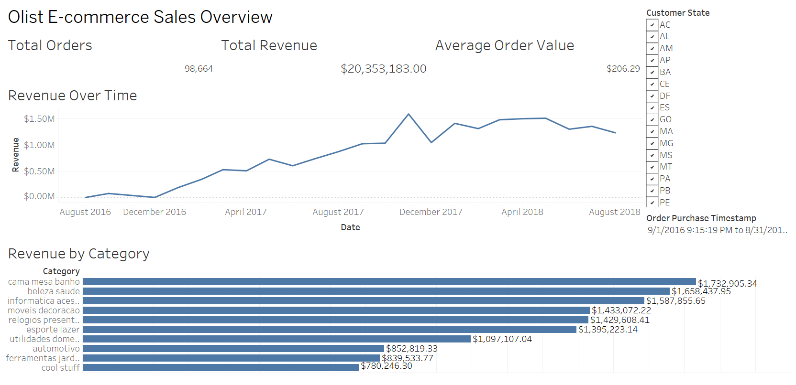

Olist E-commerce Data Analysis

This project explores the Brazilian e-commerce dataset from Olist using SQL (PostgreSQL) and Tableau. The goal is to uncover trends, performance metrics, and customer insights across orders, revenue, and product categories.

---

Tableau Dashboard

[View Interactive Dashboard on Tableau Public](https://public.tableau.com/shared/6T58SSD7X)

The dashboard includes:
- Key performance indicators: Total Orders, Total Revenue, Average Order Value
- Revenue Over Time: Monthly trend analysis
- Top Product Categories by Revenue
- Filters by Customer State and Order Date for drill-down insights

Built with a focus on clean design, dynamic filters, and usability.

---

SQL Analysis (PostgreSQL)

SQL queries were used to clean, join, and explore the dataset prior to visualization. Topics covered:
- Revenue and order trends
- Top-selling categories and product performance
- Customer behavior across regions
- Review score breakdown and delivery times

You can find the SQL scripts in the /sql folder.

---

Python (Data Cleaning)

Two Python scripts are included in the `/python` folder for cleaning and preparing the reviews dataset before analysis:

- `clean_order_reviews_encoding.py`: Cleans encoding issues, removes non-printable characters, and drops duplicates.
- `filter_and_clean_malformed_reviews.py`: Filters out malformed CSV rows, ensures column structure, and outputs a clean file ready for PostgreSQL import.

---

Dataset Info

Source: https://www.kaggle.com/datasets/olistbr/brazilian-ecommerce

Tables used:
- orders
- order_items
- customers
- products
- order_payments
- order_reviews
- sellers

---

Tools Used

- PostgreSQL  
- DBeaver  
- Tableau Desktop  
- Python (pandas, regex)  
- GitHub for version control and documentation

---

Author

Cody Stuerman  
Data Analytics | Tableau | SQL  
Email: [c.stuerman@outlook.com](mailto:c.stuerman@outlook.com)  
LinkedIn: [www.linkedin.com/in/codystuerman](https://www.linkedin.com/in/codystuerman)

